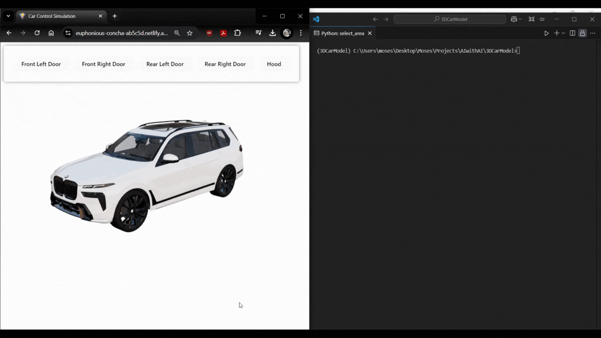

# 3D Car Component State Detection

## Project Overview

This project implements a computer vision system that detects the open/closed state of car components (doors and hood) in a 3D web interface from arbitrary viewpoints. The system uses a two-stage deep learning approach to achieve view-invariant component state detection.


## Features

- **View-Invariant Detection**: Accurately detects component states regardless of camera angle, zoom, or position
- **Real-Time Inference**: Processes screenshots from the browser quickly for seamless user experience
- **Robust Recognition**: Works with partial occlusions and challenging viewpoints
- **Web Interface**: Simple web UI showing the state of all car components

## Model Architecture

We implemented a two-stage approach to solve the view-invariance challenge:

1. **Contrastive Pre-training**: Trains a ResNet-50 backbone to learn view-invariant features by mapping different views of the same component state to similar points in embedding space
2. **Multi-Head Image Classification Fine-tuning**: Adds component-specific classification heads to handle different components

This approach allows the model to recognize the state of car components regardless of viewpoint and camera position.

## Setup Instructions

### Prerequisites

- Python 3.11
- CUDA-capable GPU (recommended)

### Installation

1. Clone the repository with Git LFS to download model weights:

```bash
# Install Git LFS
git lfs install

# Clone the repository
git clone https://github.com/mosesananta/3D-Car-Component-Detection.git
cd 3D-Car-Component-Detection
```
2. Create a virtual environment and install dependencies:
```bash
uv venv
.venv\Scripts\activate
uv pip install torch==2.4.1 torchvision==0.19.1 --extra-index-url https://download.pytorch.org/whl/cu124
uv pip install -r requirements.txt
```

## Usage Guide
### Running the Web Application

1. Configure monitor and capture area:



```bash
python select_area.py
```


2. Start the FastAPI web server:


```bash
python app.py
```

Open your browser and navigate to http://localhost:8000
After clicking the `Start Capture` button, the application will automatically capture screenshots of the 3D car interface from the configured capture area and display component states

3. (*Bonus*) VLM Inference:

```bash
python app_vlm.py
```
Open your browser and navigate to http://localhost:8000 to start interacting with the VLM interface. Screen capture will capture screenshot from the configured capture area to be analyzed by the VLM.

**Important Note**: script loading may take 5-10 minutes depending on hardware

## Training Your Own Models
### 1. Data Collection & Data Preprocessing

```bash
python data_collection.py
```
This will run selenium based data collection on the launched browser

```bash
python data_preprocessing.py
```
This will launch color-based object detection that detect the car object and normalize the translation aspect of the object by recentering the canvas around the detected car object and then resizing the image to be fitted to the model

### 2. Two Phase Model Training

```bash
python contrastive_pretraining.py
python fine_tuning.py
```

## Kaggle Notebooks
We've provided kaggle notebooks that can be launch directly on kaggle.
This notebook includes:
* Optimized Data Collection, leveraging Vulcan-based GPU Rendering for faster 3D webview processing
* Contrastive Pre-Training and Fine-Tuning Pipeline
* VLM Fine-Tuning

Important note before launching the notebook, make sure the dataset path is set before training the model

## Troubleshooting Guide
Please make sure the dataset and model path in the `CONFIG` variable is properly and correctly defined

